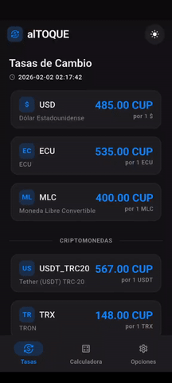

# AlTOQUE 

<p align="center">
  
</p>

Aplicación **Flutter** para consultar tasas de cambio del mercado informal cubano, utilizando datos de la **API de elTOQUE**.

---

## ✨ Características

- ✅ Calculadora de conversión entre múltiples monedas (**CUP, USD, MLC, USDT**, etc.)
- ✅ Tasas actualizadas automáticamente desde la API de **elTOQUE**
- ✅ Funciona **offline** con datos en caché
- ✅ Modo **oscuro / claro**
- ✅ Tasas personalizables

---

## 🚀 Instalación

### 1️⃣ Clonar el repositorio
```bash
git clone https://github.com/AndyCG03/al_toque_app.git
cd al_toque_app
````

### 2️⃣ Configurar variables de entorno

```bash
cp .env.example .env
```

Edita el archivo `.env` y agrega tu **token de la API**
Obtén el token aquí 👉 [https://tasas.eltoque.com/docs/](https://tasas.eltoque.com/docs/)

### 3️⃣ Instalar dependencias

```bash
flutter pub get
```

### 4️⃣ Ejecutar la aplicación

```bash
flutter run
```

---

## 🛠 Requisitos

* Flutter SDK **3.16.0** o superior
* Dart **3.0** o superior
* Token de la API de **tasas.eltoque.com**

---

## 📱 Ejemplo de pantallas

<p align="center">
  
</p>

---

## 📄 Licencia

MIT License

---

